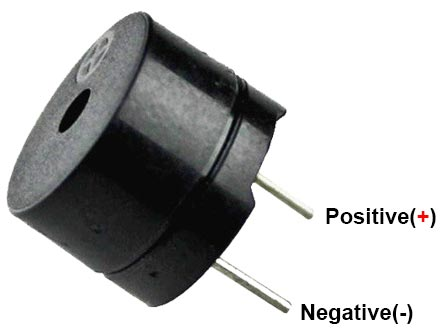

# Hoe sluit je een buzzer aan op een Nano RP2040 Connect'

## Pinnen van de buzzer:
Gnd (De lange pin): De min

Digital (+): Aansluiting voor het digitale signaal (stuurt de toonfrequentie) en is de korte pin

## Aansluiten op de Nano RP2040 Connect
Gnd: Verbind de Gnd-pin van de buzzer met een GND-pin op het board.
Digital (+): Verbind de digital-pin (+) van de buzzer met een digitale pin naar keuze op het board