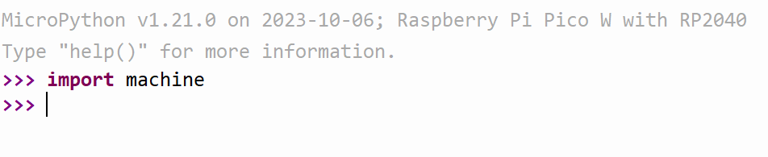

# Code schrijven in de REPL (Read–eval–print loop)

## Stap 1: open Thonny
Open de Thonny applicatie op je computer.

## Stap 2: verbind je microcontroller
Verbind je microcontroller met je computer.
Ben je vergeten hoe dit moest? Bekijk dan de vorige stap.

## Stap 3: kies een poort
Klik rechtsonder in Thonny en kies wat begint met MicroPython.


## Stap 4: typ je eerste Python code in de Repl

Typ:
```python
import machine
```
en druk op Enter!




