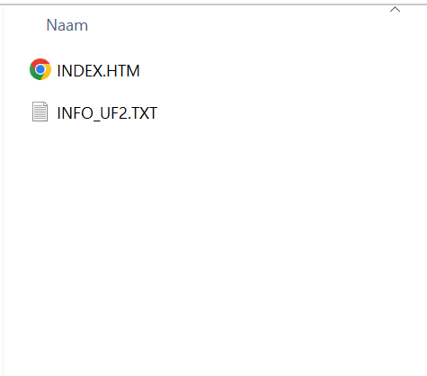
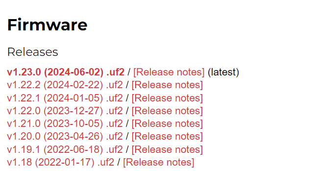
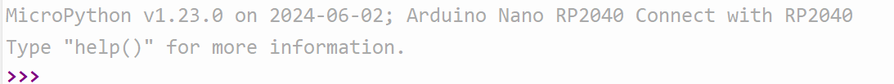

# Installatie MicroPython

## Bootloader
Open de REPL (zie vorige stap) en typ
```python
import machine 
machine.bootloader()
```
Je ziet een boel foutmeldingen, maar als het goed is opent zich ook de **Verkenner**, die er als het goed is zo uitziet:



## Download MicroPython

Download de correcte firmware via [hier](https://micropython.org/download/ARDUINO_NANO_RP2040_CONNECT/)
en kies dan de bovenste van (er kunnen nieuwere versies bijstaan):



## Slepen
Nu komt iets ingewikkelds. Sleep:
- de gedownloade firmware van je Downloads
- naar de **Verkenner** die opende toen je **machine.bootloader()** draaide.

## terug naar Thonny
Kies nu in Thonny opnieuw voor Micropython rechtsonder in het scherm.
Als het goed is staat er nu iets als:




