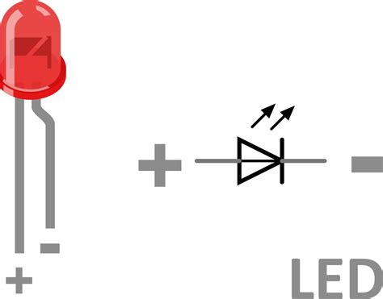

# Wiring

# Hoe sluit je een led aan op de Nano RP2040 Connect

# De pinnen van het lampje:

Vcc (De lange pin): De plus

DO (De korte pin): De digitale uitgang

## Aansluiten op de Nano RP2040 Connect

Vcc: verbind de Vcc pin van het lampje aan de 3.3v van het board

DO: verbind de DO pin aan een digitale pin naar keuze, bijvoorbeeld D3