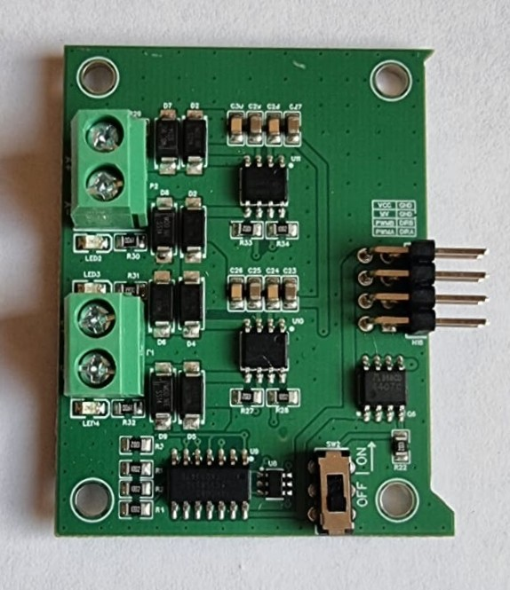
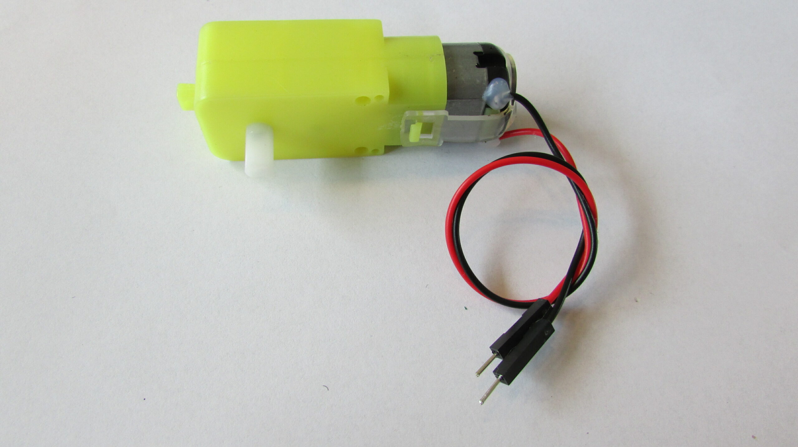

# Materiaal
1. [Arduino Nano RP2040 connect](https://docs.arduino.cc/hardware/nano-rp2040-connect/)
2. Leaphy Murphy Shield
3. Motor Module voor Leaphy Murphy Shield
4. DC-motor (2x) 

## Leaphy Murphy Shield

## Motor Module voor Leaphy Murphy Shield

## DC-motor

