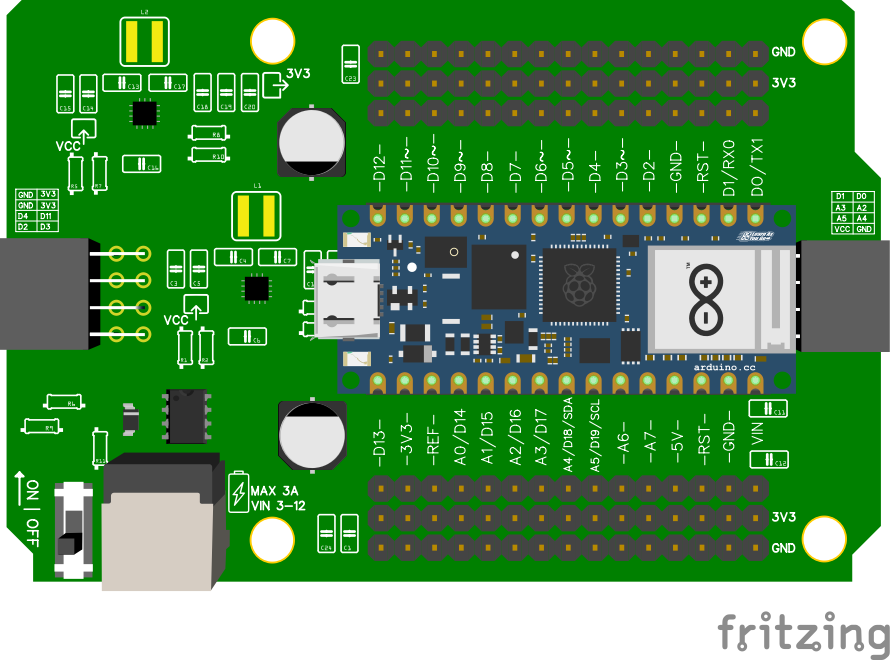

# Wiring

# Hoe sluit je twee motoren aan op een motorshield voor de Nano RP2040 connect?

## Plaats Arduino Nano op Leaphy Murphy Shield

## Verbindg motor module met shield
Deze video kan nuttig zijn:
<iframe width="640" height="360" src="https://www.youtube.com/embed/JqjtGiUV-DM" title="Stap 4 Bouwen Leaphy Starling:  Electronica vastzetten" frameborder="0" allow="accelerometer; autoplay; clipboard-write; encrypted-media; gyroscope; picture-in-picture; web-share" referrerpolicy="strict-origin-when-cross-origin" allowfullscreen></iframe>

## Verbinden motoren met motor module
<iframe width="640" height="360" src="https://www.youtube.com/embed/adpjVscMvoA" title="tt motoren aansluiten" frameborder="0" allow="accelerometer; autoplay; clipboard-write; encrypted-media; gyroscope; picture-in-picture; web-share" referrerpolicy="strict-origin-when-cross-origin" allowfullscreen></iframe>

## Pinnen van de dcmotor:

VCC(het rode draadje van de motor): De plus (3.3v)

Gnd(Het zwarte draadje van de motor): Aarde (min)

## Pinnen van het motorshield:

Vcc(te herkennen aan het plusje bij de groene connector): De plus (3.3v)

Gnd(te herkennen aan het minnetje bij de groene connector): Aarde (min)

## Aansluiten op het motorshield

Verbind de rode draad (VCC) van de eerste motor met de M1+ aansluiting op het motorshield.

Verbind de zwarte draad (GND) van de eerste motor met de M1- aansluiting op het motorshield.

Verbind de rode draad (VCC) van de tweede motor met de M2+ aansluiting op het motorshield.

Verbind de zwarte draad (GND) van de tweede motor met de M2- aansluiting op het motorshield.

