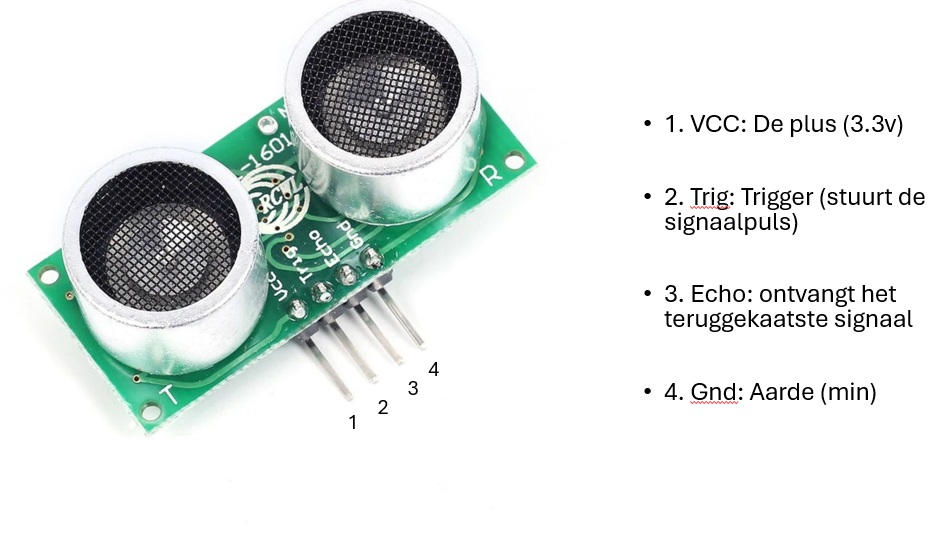

# Wiring

# Hoe sluit je een afstandssensor aan op een Nano RP2040 connect?

## Pinnen van de afstandssensor:

## Aansluiten op de Nano RP2040 Connect

VCC: Verbind de VCC-pin van de sensor met de 3.3V-pin op het board.

Trig: Verbind de Trig-pin met een digitale pin naar keuze op het board (bijvoorbeeld D2).

Echo: Verbind de Echo-pin met een andere digitale pin naar keuze op het board (bijvoorbeeld D3).

GND: Verbind de GND-pin van de sensor met een GND-pin op het board.