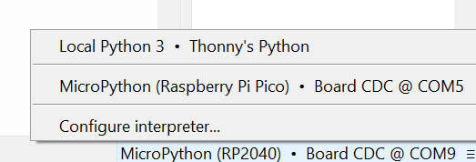
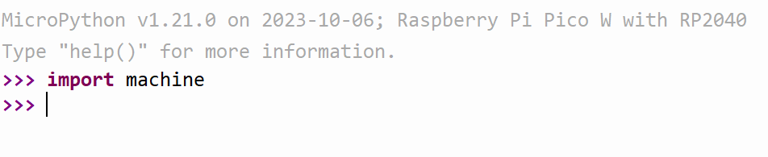

# Code schrijven in de REPL (Read–eval–print loop)

## Stap 1: open Thonny
Open de Thonny applicatie op je computer.

## Stap 2: verbind je microcontroller
Verbind je microcontroller met je computer.
Ben je vergeten hoe dit moest? Bekijk dan de vorige stap.

## Stap 3: kies een poort
Klik rechtsonder in Thonny en kies wat begint met MicroPython.



## Stap 4: typ je eerste Python code in de Repl

Typ:
```py
import machine
```
en druk op Enter!



## Stap optioneel: 

Voor Linux-gebruikers: Als je Linux gebruikt, kun je eenvoudig
de REPL-modus openen met behulp van tio, een terminaltool die via USB 
met je microcontroller communiceert.

Installeer tio: Installeer eerst tio door het volgende commando 
in je terminal uit te voeren:

```bash
sudo apt install tio
```
#### Start tio op je usb port

Maak verbinding met je microcontroller door tio te starten op de juiste USB-poort:

```bash
tio /dev/ttyACM0
```
En dan zie je in de terminal als het goed is dit: 

```bash
>>>
```


