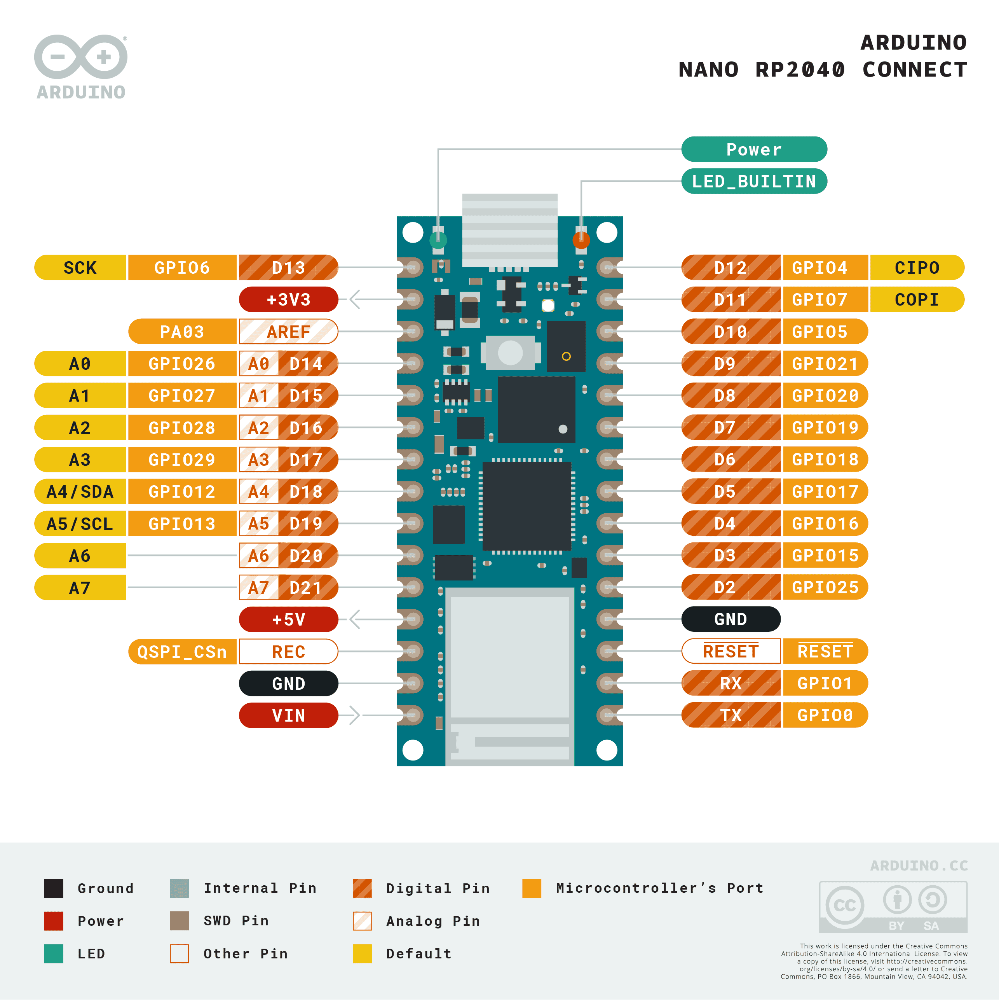

# Pin kiezen

## Stap 1: Welke pinnen waren er ook alweer?



## Stap 2: Pin kiezen

Laten we ons lampje verbinden met Pin **D7**.
Maar hoe komen we erachter hoe deze pin heet op onze microcontroller?
Open de REPL!

## Stap 3: Namen van pinnen bekijken
```python
import machine 
print(dir(machine.Pin.board))
```
Als het goed is zie je nu: 
```markdown
['__class__', '__name__', '__bases__', '__dict__', 'A0', 'A1', 'A2', 'A3', 'D10', 'D11', 'D12', 'D13', 'D18', 'D19', 'D2', 'D20', 'D21', 'D3', 'D4', 'D5', 'D6', 'D7', 'D8', 'D9', 'LED', 'LED_BLUE', 'LED_GREEN', 'LED_RED', 'RX', 'SCL', 'SDA', 'TX']
```
Dit zijn alle namen die Python herkent als namen voor pinnen. 
Gelukkig staat **D7** erbij! Deze kunnen we dus gebruiken.

