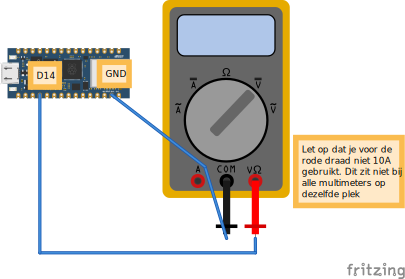

# Pin nameten

## Aansluiten



## Code

```python
from machine import Pin
from time import sleep

# Initialize the pin (e.g., pin 14) as an output
pin = Pin("D14", Pin.OUT)

while True:
    # Set the pin to high
    pin.value(1)  # Sets the pin to HIGH (3.3V)
    sleep(1)
```
Als het goed is, zie je 3.3v op je scherm van de multimeter!

```python
pin.value(0)
```
En nu 0v!