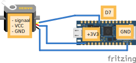

# Wiring & Code

# Hoe sluit je een servo aan op een Nano RP2040 Connect?


## De pinnen van de servo uitgelegd:

Gnd (De het bruine kabeltje): De min

Vcc (Het rode kabeltje): De plus (3.3v)

DO (Het oranje kabeltje): de digitale uitgang

## Aansluiten op de Nano RP2040 Connect

VCC: Verbind de VCC-pin van de IR-sensor met de 3.3V-pin op de Nano RP2040 Connect

GND: Verbind de GND-pin van de IR-sensor met een GND-pin op het board.

DO: Verbind de OUT-pin van de sensor met een digitale pin van de Nano RP2040 Connect, bijvoorbeeld D6.

## Code

Eerst moet je de juiste library importeren:

```py
from leaphymicropython.actuators.servo import set_servo_angle
```

Gebruik dan de functie set_servo_angle om de servo naar de gewenste hoek te draaien:

```py
set_servo_angle(pin_number, angle)
```

Bijvoorbeeld
```python
set_servo_angle(7,90)
```

## Uitleg hoe de functies werken

### Parameters:
Pin_number: Het pinnummer (begint met D) waarop de servo is aangesloten.

Angle: De hoek waarop de servo moet draaien (0-180 graden).
