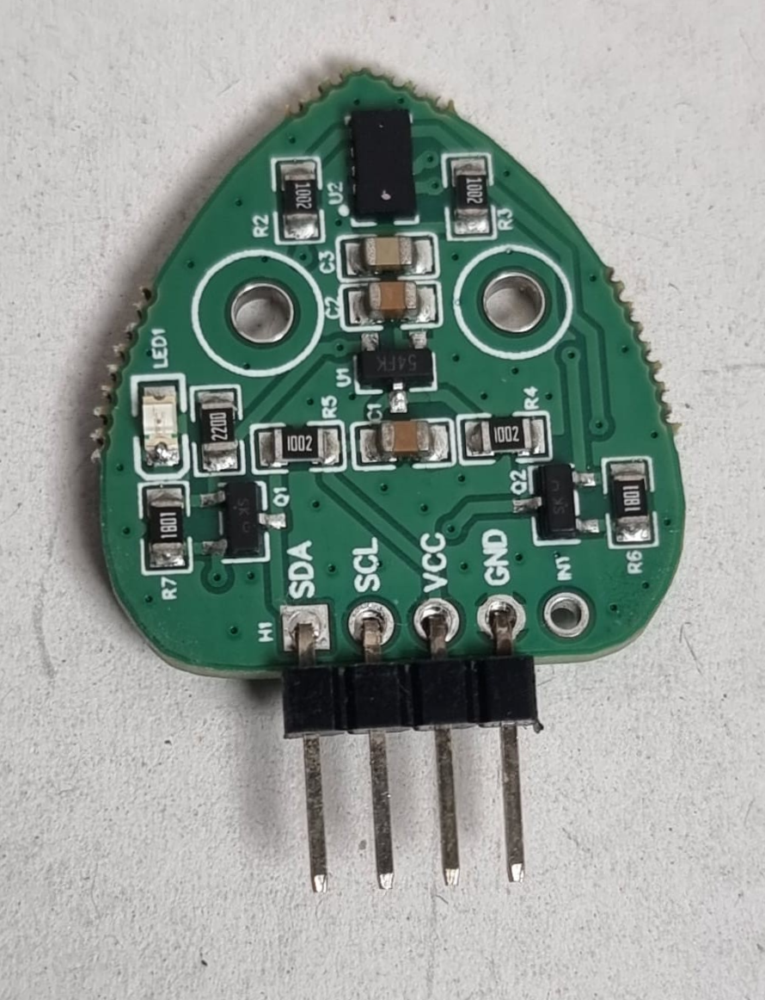
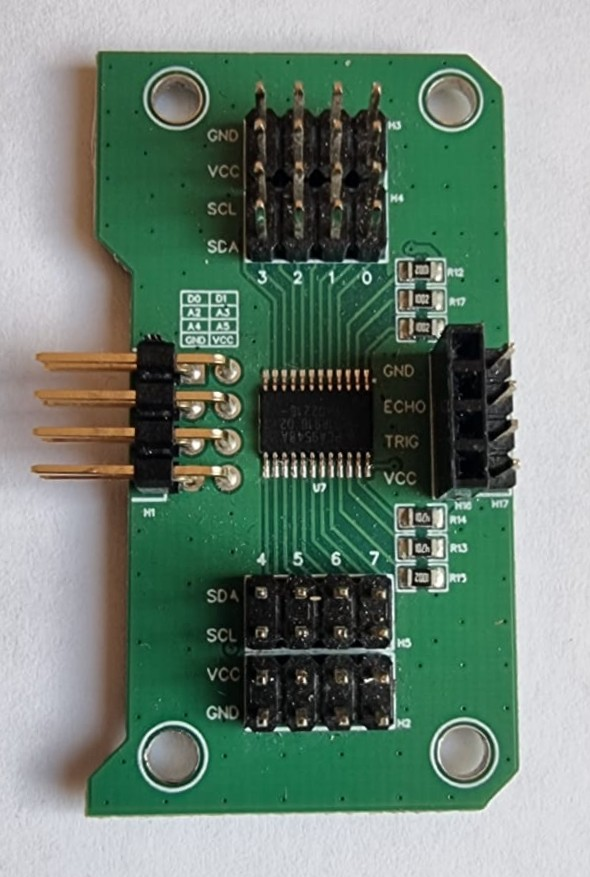

# Materiaal

- Nano RP2040 Connect
- Time of flight sensor
- [nodig bij 2 of meer TOF sensoren] SDA/SCL module Leaphy Murphy shield

## Time of flight sensor

## SDA/SCL module Leaphy Murphy shield

