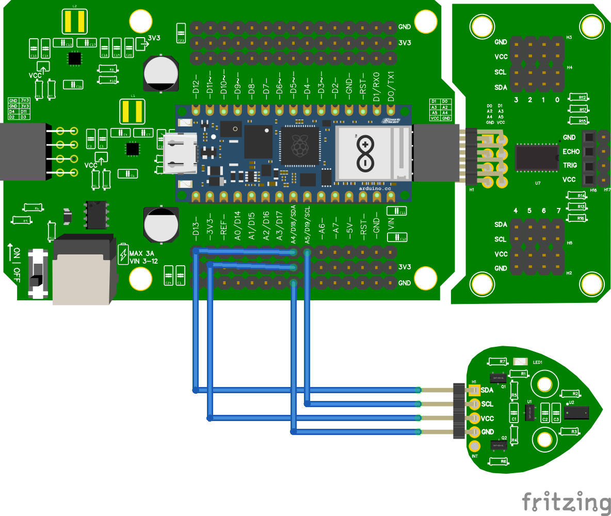

# Wiring & Code zonder multiplexer

## Wiring


## Code
```python

from leaphymicropython.sensors.tof import TimeOfFlight
from time import sleep

tof = TimeOfFlight()

while True:
    distance = tof.get_distance()

    print(distance)
    sleep(1)
```