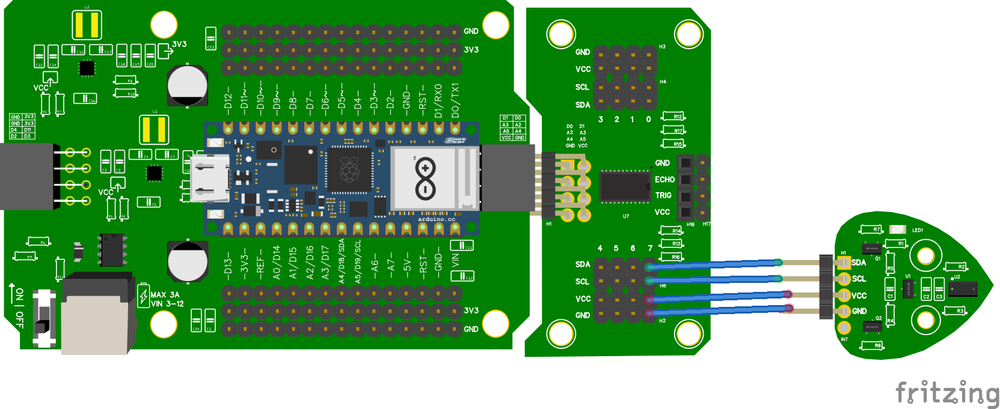

# Wiring & Code met multiplexer

## Wiring


## Code
```python

from leaphymicropython.sensors.tof import TimeOfFlight
from time import sleep

tof = TimeOfFlight(channel=7)

while True:
    print(tof.get_distance())
    sleep(1)
```

## Let op
Dat je **channel** op het goede getal zet. 
In het voorbeeld hebben we de sensor verbonden met channel 7. Dit kun je weten vanwege het getal zeven boven de verbonden pinnen.