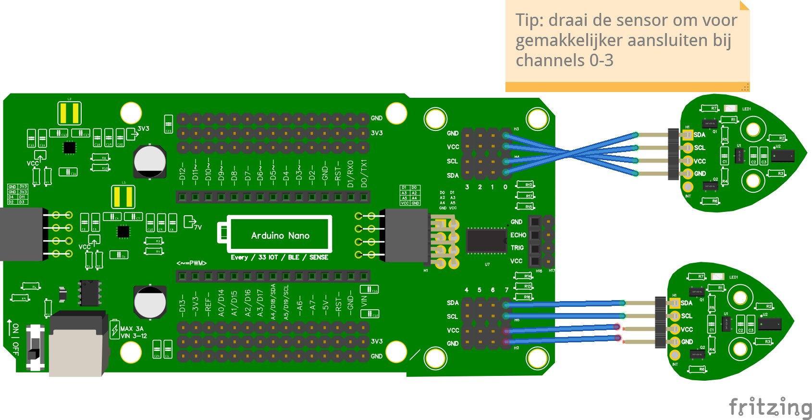

# Wiring & Code 2 of meer Time of Flight sensoren

## Wiring


## Code
```python

from leaphymicropython.sensors.tof import TimeOfFlight
from time import sleep

tof_0 = TimeOfFlight(channel=0)
tof_7 = TimeOfFlight(channel=7)

while True:    
    distance_tof_0 = tof_0.get_distance()
    distance_tof_7 = tof_7.get_distance()

    print(distance_tof_0, distance_tof_7)
    sleep(1)
```