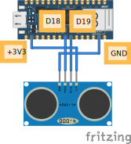

# Wiring & Code

## Voorbeeld van aansluiten




## Code

Eerst moet je de juiste library importeren:

```py
from time import sleep
from leaphymicropython.sensors.sonar import read_distance
```
En dan gebruik je een loop om te zorgen dat de afstand in centimeter om de seconde
wordt geprint

```py
while True:
    print(read_distance(19,18))
    sleep(1)
```
- 19 --> pin D19 (trig)
- 18 --> pin D18 (echo)

## Aansluiten op de Nano RP2040 Connect

VCC: Verbind de VCC-pin van de sensor met de 3.3V-pin op het board.

Trig: Verbind de Trig-pin met een digitale pin naar keuze op het board (bijvoorbeeld D2).

Echo: Verbind de Echo-pin met een andere digitale pin naar keuze op het board (bijvoorbeeld D3).

GND: Verbind de GND-pin van de sensor met een GND-pin op het board.