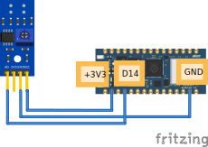

# Wiring & Code

## Een voorbeeld van een analoge ir-sensor aansluiten

Hierbij een voorbeeld van hoe je een analoge ir-sensor kunt aansluiten en kunt uitlezen.



## De code
Eerst moet je de juiste library importeren:

```py
from time import sleep
from leaphymicropython.utils.pins import read_analog
```

En dan gebruik je een loop om te zorgen dat de ir waaarde om de seconde
wordt geprint.

```py
while True:
    print(read_analog(14))
    sleep(1)
```

De 14 hier verwijst naar D14 (zie afbeelding hierboven).


## Belangrijke informatie over de analoge pinnen

https://support.arduino.cc/hc/en-us/articles/7454007471004-About-the-analog-pins-on-Nano-RP2040-Connect

## Pinnen van de analoge IR-sensor:
VCC: De plus (3.3v)

GND: Aarde (min)

AO: De analoge uitgang