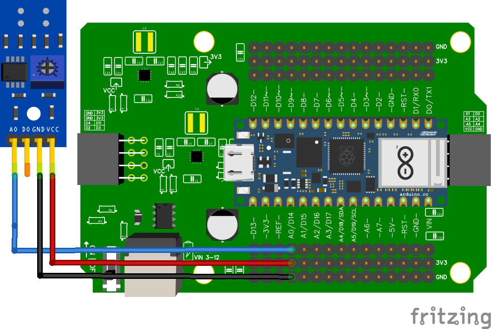

# Analoge IR sensor

import Tabs from '@theme/Tabs';
import TabItem from '@theme/TabItem';

<Tabs>
  <TabItem value="material" label="Materiaal" default>
    Nano RP2040 Connect

    Analoge IR-sensor:

    
  </TabItem>
  <TabItem value="shield_1_analog_ir" label="Shield met 1 Analoge IR" default>

Hierbij een voorbeeld van hoe je een analoge ir-sensor kunt aansluiten en kunt uitlezen.



```python
from leaphymicropython.sensors.linesensor import AnalogIR

a0 = AnalogIR("A0", 2500)

while True:
    a0_ir = a0.get_analog_value()
    a0_color = a0.black_or_white()
    
    print()
    print(a0_ir, a0_color)
```
1. b
2. a


  </TabItem>
  <TabItem value="shield_2_analog_ir" label="Shield met 2 Analoge IR">
    This is an orange 🍊
  </TabItem>

</Tabs>