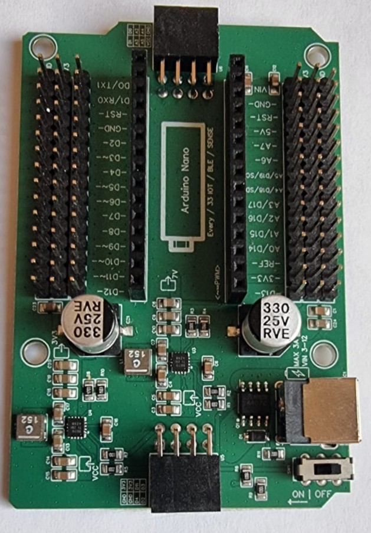

# Materiaal

Wat heb je nodig?

- Nano RP2040 Connect
- Analoge IR-sensor (zie afbeelding hieronder)
- Leaphy Murphy Shield (zie afbeelding hieronder)

## Analoge IR-sensor

## Leaphy Murphy Shield
