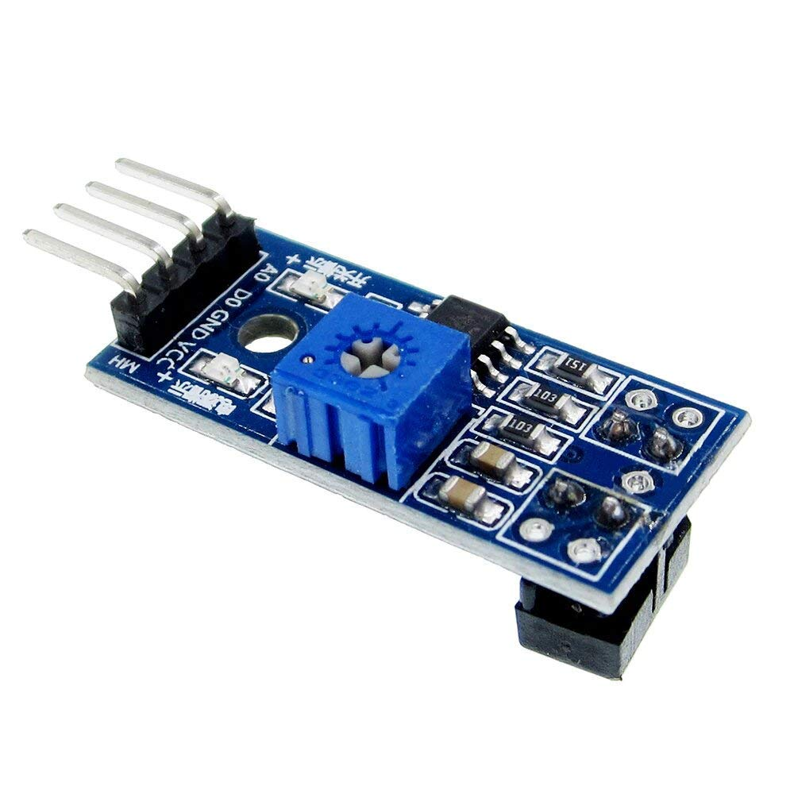

# Materiaal

Wat heb je nodig?

1. Nano RP2040 Connect
2. Analoge IR-sensor (zie afbeelding hieronder)
3. Leaphy Murphy Shield (zie afbeelding hieronder)

## Analoge IR-sensor

## Leaphy Murphy Shield
