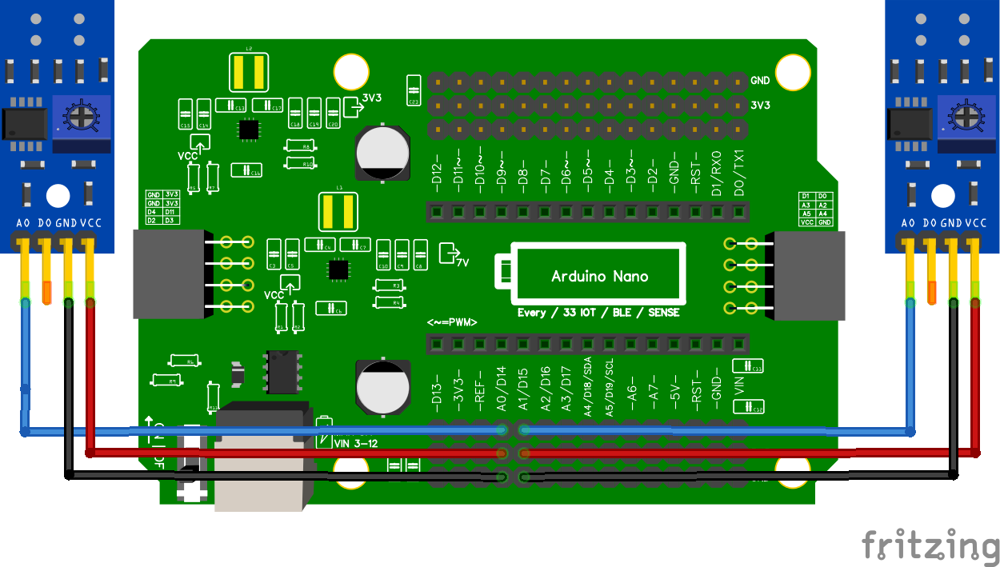

# Hoeveel kan ik er aansluiten?

In de praktijk is het antwoord: 6.
Meestal gebruiken mensen twee als ze het voor de eerste doen, vier als je al wat meer ervaring hebt.

## Wel gebruiken: A0, A1, A2, A3, A6, A7
## Niet gebruiken: A4, A5

