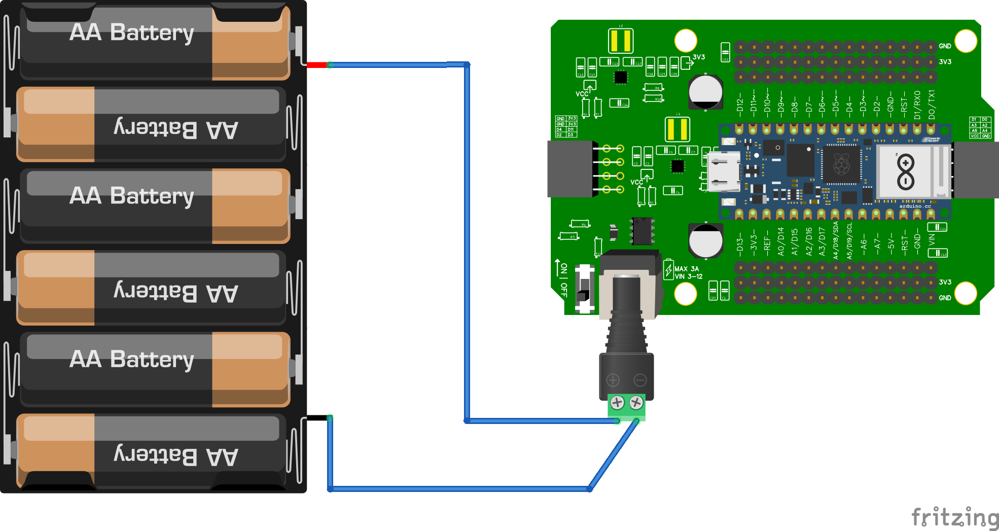

# Wiring

## Stap 1: nameten batterijen
Meet met je multimeter de spanning van iedere batterij

## Stap 2: batterijhouder nameten
We moeten zeker weten dat de batterijhouder goed werkt.
Meet met je multimeter de spanning van de batterijhouder.
Plaats de batterijen erin en meet de batterijhouder na via de rode en zwarte draad die uit de batterijhouder komt.

## Stap 3: sluit de batterijhouder aan aan het shield

Zet de schakelaar op het shield op "on" en je zou een groen lampje moeten zien.