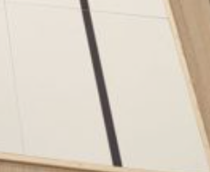

# Wiring & Code

# Hoe sluit je een digitale IR-sensor aan op een RP2040 connect?


# Code

Eerst moet je de juiste library importeren:

```py
from time import sleep
from leaphymicropython.sensors.linesensor import read_line_sensor
```

Dan gebruik je een loop om steeds de ir-sensor uit te lezen en dan krijg je een
1 of een 0 terug want het is digitaal
```py
while True:
    print(read_line_sensor(14))
    sleep(1)
```

## Hoe kan ik deze sensor gebruiken bij de RoboCup?

Pak een tegel van de RoboCup competitie (maakt niet uit welke):




Houd je IR sensor boven de tegel. Wanneer geeft:
- `read_line_sensor(14)` de waarde 1
- `read_line_sensor(14)` de waarde 0

Je kunt bij het digitaal uitlezen (deze tutorial) de sensor stellen met een schroevendraaier. Je verandert dan de overgang van wat de sensor denkt dat de overgang is van zwart naar wit.

Zie voor meer informatie: [Redden Basis](/docs/Competities/RoboCup-Junior/Redden-Basis/redden_basis)

## Pinnen van de digitale IR-sensor:
VCC: De plus (3.3v)

GND: Aarde (min)

DO: De digitale uitgang

## Aansluiten op de Nano RP2040 Connect
VCC: Verbind de VCC-pin van de IR-sensor met de 3.3V-pin op het board

GND: Verbind de GND-pin van de IR-sensor met een GND-pin op het board.

DO: Verbind de DO-pin van de sensor met een digitale pin naar keuze op het board, bijvoorbeeld D5