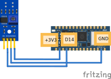

# Wiring & Code

# Hoe sluit je een digitale IR-sensor aan op een RP2040 connect?



# Code

Eerst moet je de juiste library importeren:

```py
from time import sleep
from leaphymicropython.sensors.linesensor import read_line_sensor
```

Dan gebruik je een loop om steeds de ir-sensor uit te lezen en dan krijg je een
1 of een 0 terug want het is digitaal
```py
while True:
print(read_line_sensor(14))
sleep(1)
```


## Pinnen van de digitale IR-sensor:
VCC: De plus (3.3v)

GND: Aarde (min)

DO: De digitale uitgang

## Aansluiten op de Nano RP2040 Connect
VCC: Verbind de VCC-pin van de IR-sensor met de 3.3V-pin op het board

GND: Verbind de GND-pin van de IR-sensor met een GND-pin op het board.

DO: Verbind de DO-pin van de sensor met een digitale pin naar keuze op het board, bijvoorbeeld D5