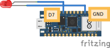

# Code & Wiring

## aansluiten




## code

```python
from machine import Pin
pin_7 = Pin('D7', Pin.OUT)
pin_7.on()
```

Als het goed is zie je nu je lampje branden!

# De pinnen van het lampje:

Vcc (De lange pin): De plus

DO (De korte pin): De digitale uitgang

## Aansluiten op de Nano RP2040 Connect

Vcc: verbind de Vcc pin van het lampje aan de 3.3v van het board

DO: verbind de DO pin aan een digitale pin naar keuze, bijvoorbeeld D3