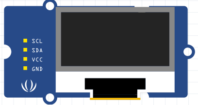
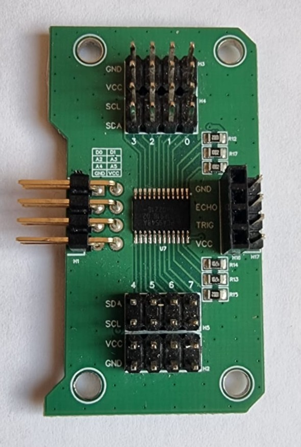

# Materiaal

## Zonder multiplexer
- Arduino Nano RP2040 Connect
- Oled scherm

Het kan zijn dat het oled-schermpje zelf er net anders uitziet, afhankelijk van het merk.

## Met multiplexer heb je de volgende zaken ook nodig
- SDA/SCL module Leaphy Murphy shield
- 4 pins Jumperkabel female/female  

