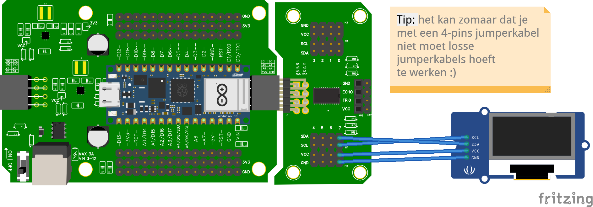

# Wiring & Code met multiplexer



## Code

Eerst moet je de juiste library importeren:

```py
from leaphymicropython.actuators.ssd1306 import SSD1306I2C
```
Met deze code kun je tekst weergeven op een OLED-scherm via I2C-communicatie. Dit voorbeeld laat zien hoe je de boodschap "Hello, World!" meerdere keren op het scherm kunt tonen.

## Uitleg van de Code

Vervolgens definieer je de breedte en hoogte van het OLED-scherm. Dit voorbeeld gebruikt 
- een scherm met een resolutie van 128x64 pixels.
- channel 7 van de multiplexer

```py
oled = SSD1306I2C(width=128, height=64, channel=7)
```
## Tekst Weergeven

Met de text()-functie kun je tekst op specifieke locaties op het scherm plaatsen. De tekst wordt pas zichtbaar nadat je show() aanroept.

```py
oled.text('Hello, World 1!', 0, 0)
oled.text('Hello, World 2!', 0, 10)
oled.text('Hello, World 3!', 0, 20)
oled.show()
```

### Parameters van de text()-functie
Bericht: De tekst die je wilt tonen (type: String).
X-positie: Horizontale startpositie van de tekst.
Y-positie: Verticale startpositie van de tekst.
Kleur (optioneel): 1 (wit) of 0 (zwart).

```py
oled.text('Hallo!', 0, 30)  # Tekst op x=0, y=30
oled.show()
```
### Andere Functies
De library bevat ook andere handige methodes:

Scherm vullen: Vul het hele scherm met een kleur (wit of zwart).

```py
oled.fill(1)  # Scherm volledig wit maken
oled.show()
oled.fill(0)  # Scherm volledig zwart maken
oled.show()
```

Pixel tekenen: Teken een enkele pixel op specifieke coördinaten. 
```py
oled.pixel(10, 10, 1)  # Pixel tekenen op (10, 10)
oled.show()
```
Kleuren omkeren: Wissel wit en zwart om met invert().

```py
oled.invert(True)   # Kleur omkeren
oled.invert(False)  # Terug naar normale kleuren
```
### Sensorwaarden Weergeven
   
Als je sensorgegevens wilt tonen, moet je deze eerst omzetten naar een string met str().

Voorbeeld:
```py
temperatuur = 22.5
oled.text('Temp: ' + str(temperatuur) + 'C', 0, 40)
oled.show()
```

