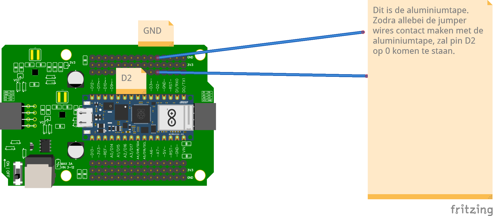

# Detectie evacuatiezone

## Via pull-up resistor


## Code
```python 
import machine
from machine import Pin
from time import sleep

pin = machine.Pin("D5", Pin.IN, Pin.PULL_UP)

while True:
    print(pin.value())
    sleep(0.1)
```

Zodra de twee draden verbinding maken met het aluminiumtape, zal pin D5 op 0 komen te staan.
Let heel goed op dat je NIET de volgende pinnen gebruikt: D2, D3, D10, D11.
Deze pinnen worden namelijk gebruikt door je motor shield en die kun je dus hiervoor niet gebruiken.

## Via RGB sensor
Geeft de RGB sensor een andere waarde bij:
- wit
- zwart
- de aluminiumtape die hoort bij de overgang naar de evacuatiezone?


