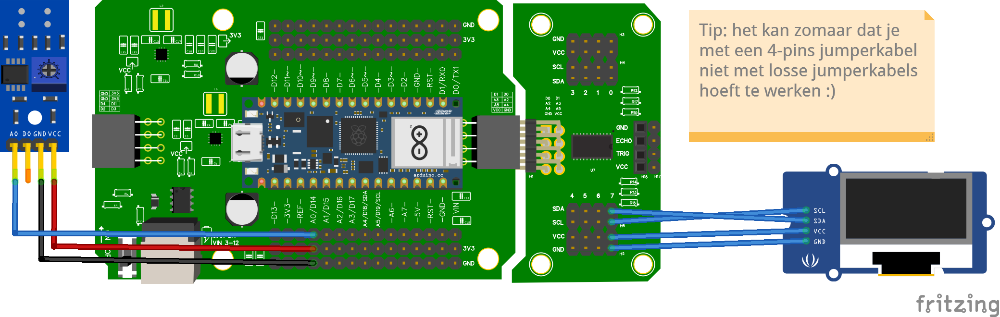

## Aansluitschema


## Code

```python
from time import sleep
from leaphymicropython.sensors.linesensor import AnalogIR
from leaphymicropython.actuators.ssd1306 import SSD1306I2C

a0 = AnalogIR("A0", 2500)
oled = SSD1306I2C(width=128, height=64, channel=7)

while True:
    a0_ir = a0.get_analog_value()
    a0_color = a0.black_or_white()
    
    oled.fill(1)  # Scherm volledig wit maken
    oled.text('Waarde A0', str(a0_ir), 0, 0) # Tekst op x=0, y=0
    oled.text('Kleur van A0', a0_color, 0, 10) # Tekst op x=0, y=10 (dus eronder)
    oled.show()   # toon op het schermpje
    sleep(0.01)
```
Als het goed is, zie je nu elke 0.01 seconde de waarde van de sensor verbonden aan A0 op je schermpje.