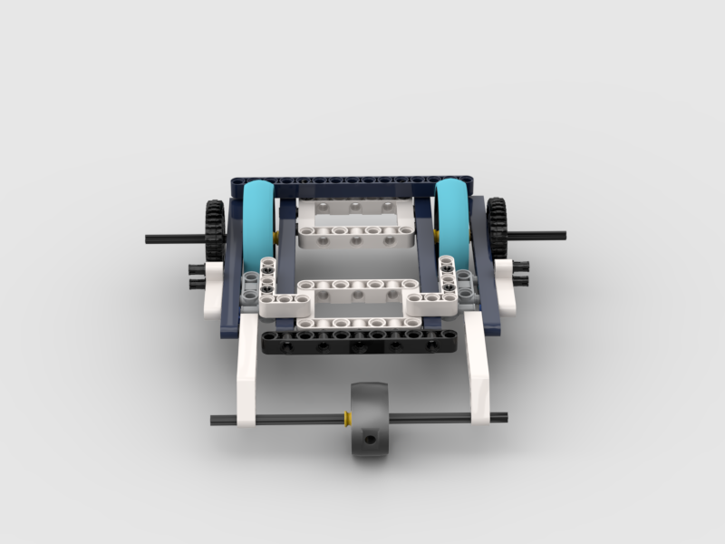

import PdfFile from '@site/static/files/v3.pdf';

# Frame

We beginnen met Lego. We gaan het onderstaande frame namaken:

## Hoe?
 
<iframe src={PdfFile} width="100%" height="600px">
    Dit is een fallback. Als de iframe niet wordt weergegeven, kunt u de PDF hier downloaden: <a href={PdfFile}>Download PDF</a>
</iframe>
