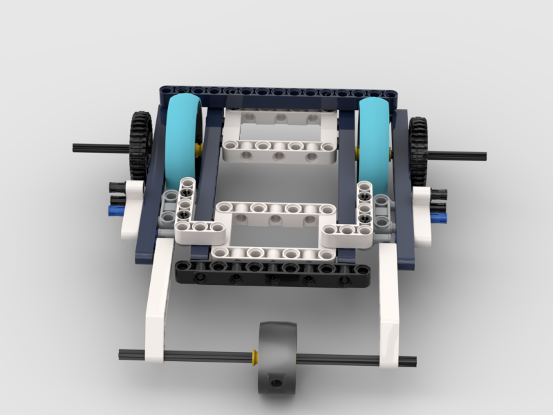

# Frame

We beginnen met Lego. We gaan het onderstaande frame namaken:

## Hoe?
<iframe src="../v3.pdf" width="100%" height="600px">
    Dit is een fallback. Als de iframe niet wordt weergegeven, kunt u de PDF hier downloaden: <a href="../v3.pdf">Download PDF</a>
</iframe>
