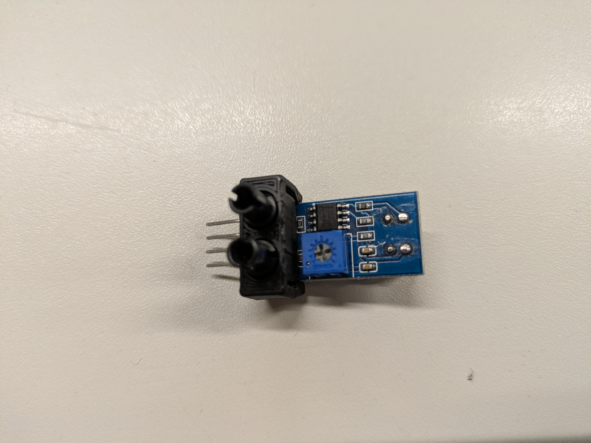

# IR-sensor verbinden aan frame met 3D geprint onderdeel

Probeer de onderstaande foto's na te doen!

Als je dit gedaan hebt, kun je vervolgens het geheel aan je legoframe koppelen. 
Meestal wordt dit geheel onderaan de balk geplaatst vóór de wielen.

